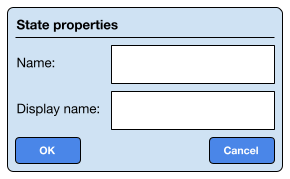

# GUI Design

_The State Diagram Editor needs to provide an intuitive interface for users to create and manage state diagrams efficiently. This document describes the design layout and GUI components for the tool._

## Main Window

The application has a **menu bar** at the top of the window.

On top of the main window - and with the same width - there is a **toolbar** for quick access to common actions. All the other components are located below the toolbar.

On the left side of the window - and with 50% of the window's width and ending at the bottom of the window - there is a **diagram canvas** for showing the rendered diagram image. The image can be clicked to be able to select states, choice-points, and transitions.

On the right side of the window there are four lists:
- **State list**: for showing the list of states present in the current diagram.
- **Choice-point list**: for showing the list of choice-points present in the current diagram.
- **Interface list**: for showing the list of interfaces defined in the PlantUML code of the current diagram.
- **Message list**: for showing the list of messages defined in the PlantUML code of the current diagram and for the selected interface.

Below the lists there is a **transition table** for showing the list of transitions present in the current diagram.

The layout of the window is shown in the following figure:

These components are described in more detail below.

### Menu Bar

The application has a **menu bar** at the top of the window.

The menu bar contains a "File" menu with the following options: 
- "New" for creating a new diagram, 
- "Save" for saving the current diagram,
- "Save As" for saving the current diagram as a new file,
- "Open" for loading diagrams, 
- "Exit" for exiting the application.

Next to the "File" menu there is a "Component" menu with the following options:

- "Change name" for changing the name of the current component.
- "Change transition font size" for changing the font size of the transitions.
- "Change state font size" for changing the font size of the states.

There is also a "Help" menu with an "About" option for showing information about the application.

### Toolbar

The toolbar provides quick access to common actions. The following table lists the buttons, their functions and the condition when they are enabled.

| Button | Function | Enabled |
|:--- |:--- |:--- |
| Save | Save the current diagram. | Only if the current diagram has been saved before and if there are unsaved edits. |
| Undo | Step backward in the edit history. | The edit history is not empty and the current action is not the first action in the history. |
| Redo | Step forward in the edit history. | The edit history is not empty and the current action is not the last action in the history. |
| Delete | Delete all selected diagram elements. | One or more diagram elements are selected, and the selected elements do not include the `START` state, one or more of the default interfaces or one or more of the default messages. |
| Add state | Add a new state to the diagram and to the list of states. | Always |
| Add choice-point | Add a new choice-point to the diagram and to the list of choice-points. | Always |
| Add transition | Add a new transition to the diagram and to the transition table. | Depending on which elements are selected, see below. |
| Add interface | Add a new interface to the list of interfaces. | Always |
| Add message | Add a new message to the list of messages. | When one interface is selected. |
| Edit | Edit the selected diagram elements. | Depending on which elements are selected, see below. |

For the "Add transition" and the "Edit" button, the enabled condition depends on which elements are selected

The "Add transition" button is enabled if:
* If the `START` state is selected, and a state is selected, and the `START` state doesn't already have a transition.
* If one or more messages are selected, and this list of selected messages doesn't contain the "Yes" or "No" message, and a state is selected that doesn't already have a transition for one or more selected messages.
* If one or more messages are selected, and this list of selected messages doesn't contain the "Yes" or "No" message, and two states or a state and a choice-point are selected as the source and target state of the transition respectively, and the source state doesn't already have a transition for one or more selected messages.
* If the "Yes" and/or "No" message are selected, and a choice-point is selected as the source state, and a state or other choice-point is selected as the target state, and the choice-point doesn't already have a transition for the selected "Yes" or "No" message.

The "Edit" button is enabled if:
* A single state or choice-point not being the `START` state is selected.
* A single interface not being the "Logical" or "Timer" interface is selected.
* A single message not being the "Yes", "No", or "Timeout" message is selected.
* All transitions that have the same source and target state are selected.

### Diagram Canvas

The diagram canvas displays the state diagram as rendered by the PlantUML server which returns a static PNG image. Typically, the image doesn't have the exact size of the canvas, so the image is centered in the canvas.

The user can click on the image to select or deselect states, choice-points, and transitions. When an element is selected, it is also selected in the corresponding list. Note that when a transition is selected, in the transition table all transitions with the source state to the target state are selected.

When the image is clicked somewhere other than an element, all selected elements are deselected.

### Element Lists

There are four lists showing the elements present in the current diagram. In the list elements can be selected or deselected by clicking on them. The selected element is indicated by a colored background. The lists are scrollable and ordered alphabetically.

The following lists are available:

- **State list**
The state list shows the `display_name` of the states if not left empty, otherwise the `name`, present in the current diagram.
- **Choice-point list**
The choice-point list shows the `question` of the choice-points present in the current diagram.
- **Interface list**
The interface list shows the `name` of the interfaces defined in the PlantUML code of the current diagram.
- **Message list**
The message list shows the `name` of the messages defined in the PlantUML code of the current diagram and for the selected interface.
 
### Transition Table

The transition table shows the list of transitions present in the current diagram. The table has the columns: "Source state", "Interface", "Message" and "Target state".

The transition table is scrollable and the columns are resizable.

The table is sorted alphabetically by the "Source state" column, then by the "Interface" column and then by the "Message" column.

The combination of "Source state", "Interface" and "Message" must be unique. If the combination is not unique, the transition is not added to the table.

## Properties Windows

When a single diagram element is selected and the "Edit" button in the toolbar is clicked, the element's properties window is shown. The properties window allows detailed editing of the selected diagram element.

A properties window is also shown when one of the "Add" buttons in the toolbar is clicked.

The following lists the properties that are shown and can be edited for each type of element:

- Interface: name
- Message: interface, name
- State: name, and optionally display name
- Choice-point: name, question
- Transition: source state, target state, connector type, connector length, interface, message

A properties window has a title, a section where the properties are shown and/or edited and below this a "OK" button (left) and a "Cancel" button (right) as shown in the following figure:

The "Cancel" button closes the window without saving the changes. If the values are valid, the "OK" button saves the changes and closes the window.

Checking the validity of the values is done when the "OK" button is clicked. For example it can be checked whether a name of the element is already used by another element.

If the values are not valid, clicking the "OK" button will not close the window - or save the changes - but instead an error message popup will be shown with an appropriate message. The popup can be closed by clicking the "OK" button in it. After closing the popup, the properties window remains open so the user can change the values and try again.

Whether or not the "OK" button is enabled depends on the type of element and the validity of the values entered.

In the following sections the properties windows for each type of element are described in more detail.

### State Properties Window

In the state properties window the `name` and `display_name` of the state can be edited.

Below the title, the window has a label "Name:" followed by an entry field for the name. Below this there is a label "Display name:" followed by an entry field for the display name.

The layout of the "State properties" window is shown in the following figure:

The `display_name` is optional and can be left empty. 

The "OK" button is only enabled if the `name` is not empty.

If the supplied `name` is already used by another state, an error message popup is shown, with the message "State name already in use". The "OK" button in this popup closes the popup and the state properties window remains open.

### Choice-point Properties Window

In the choice-point properties window the `name` and `question` of the choice-point can be edited.

Below the title, the window has a label "Name:" followed by an entry field for the name. Below this there is a label "Question:" followed by an entry field for the question.

The layout of the "Choice-point properties" window is shown in the following figure:

The "OK" button is only enabled if the `name` is not empty.

If the supplied `name` is already used by another choice-point, the error message popup is shown, with the message "Choice-point name already in use".

### Interface Properties Window

In the interface properties window the `name` of the interface can be edited.

Below the title, the window has a label "Name:" followed by an entry field for the name.

The layout of the "Interface properties" window is shown in the following figure:

The "OK" button is only enabled if the `name` is not empty.

If the supplied `name` is already used by another interface, an error message popup is shown, with the message "Interface name already in use".

### Message Properties Window

In the message properties window the `name` of the message can be edited.

Below the title, the window has a label "Interface:" followed by another label giving the name of the interface.

Below this there is a label "Name:" followed by an entry field for the name.

The layout of the "Message properties" window is shown in the following figure:

The "OK" button is only enabled if the `name` is not empty.

If the supplied `name` is already used by another message for the selected interface, an error message popup is shown, with the message "Message name already in use for this interface".

### Transition Properties Window

In the transition properties window the `connector type` and `connector length` can be edited.

First, there are 4 rows:

- A label "Source state:" followed by another label giving the name of the source state.
- A label "Interface:" followed by another label giving the name of the interface.
- A label "Message:" followed by another label giving the name of the message.
- A label "Target state:" followed by another label giving the name of the target state.

Below these 4 rows there is a label "Connector type:" followed by a combo box for selecting the connector type, with the following options: "Up", "Down", "Left" and "Right".

Only when the connector type is "Up" or "Down", will there be a label "Connector length:" followed by an entry field for the connector length with increment and decrement buttons.

The layout of the "Transition properties" window is shown in the following figure:

Because the user cannot do anything wrong in this window, the "OK" button is always enabled.

