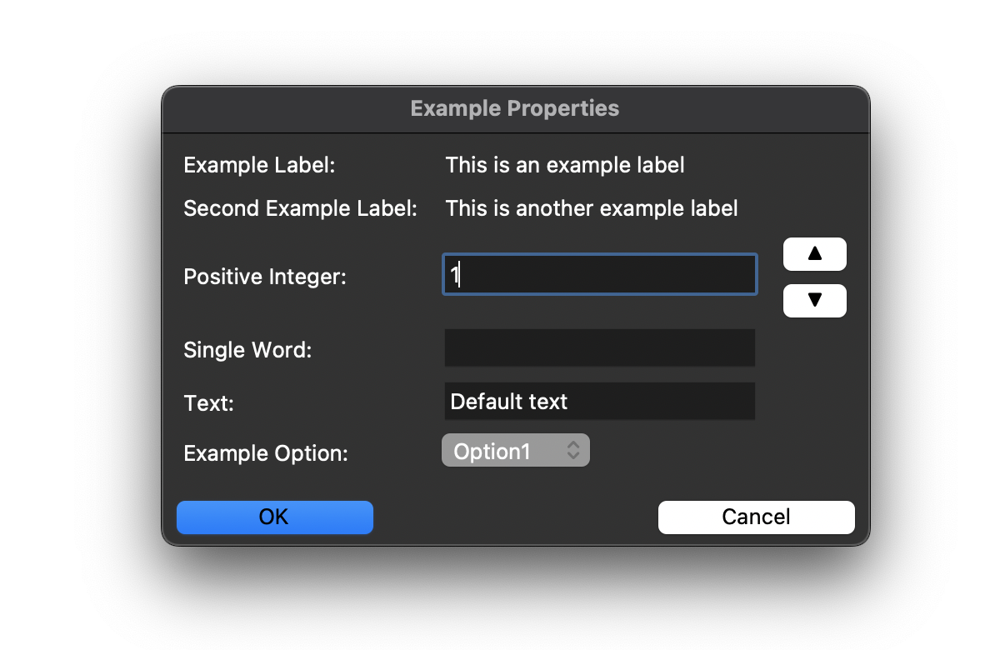

# Properties Dialogs

_The `PropertiesDialog` class is the base class for all the properties dialogs in the application._

## Dependencies

The `PropertiesDialog` class depends on TKinter and the following classes that are imported from the `tkinter` module are required:

- `tk`: to create the dialog.
- `simpledialog`: to create the dialog.
- `messagebox`: to show a message box.

```python
import tkinter as tk
from tkinter import simpledialog, messagebox
```

## Constants

The `PropertiesDialog` class has a constant for the invalid characters for a single word field.

```python
SINGLE_WORD_INVALID_CHARS = " ±§!@#$%^&()_-+=`~,<.>?/{[}];:\"'\\|\n"
```

## Description

The `PropertiesDialog` class is derived from the `simpledialog.Dialog` class, and serves as a base class for all the dialogs in the application that can be used to show and edit properties.

In a dialog, the following widgets can be used:

- `label`: a label showing a piece of information that can't be edited.
- `field`: a field that can be edited and could be validated.
- `option`: an option that can be selected.

The following field types are available:

- `text`: a text field with a default value.
- `positive_integer`: a positive integer field which can be incremented and decremented using buttons.
- `single_word`: a single word field.

In the section [Example](#example) below, it is described how to use the `PropertiesDialog` class to create a dialog.

## Attributes

The `PropertiesDialog` class has the following proprietary attributes:

| Property | Type | Description |
|-----------|------|-------------|
| `fields` | dict | The fields of the dialog. |
| `labels` | dict | The labels of the dialog. |
| `options` | dict | The options of the dialog. |
| `entries` | dict | The entries of the dialog. |
| `field_types` | dict | The field types of the dialog. |

Furthermore, from the `simpledialog.Dialog` class, the following attributes are inherited:

| Attribute | Type | Description |
|-----------|------|-------------|
| `result` | dict | The result of the dialog after the user clicks the "OK" button. |

## Constructor

The constructor of the `PropertiesDialog` class is defined as follows:

```python
def __init__(self, parent, title, fields, labels=None, options=None, field_types=None):
```

Since there must always be at least one field, the `fields` parameter is required. The `labels`, `options` and `field_types` parameters are optional and default to an empty dictionary.

```python
self.fields = fields
self.labels = labels or {}
self.options = options or {}
self.entries = {}
self.field_types = field_types or {}
```

Finally, the constructor calls the constructor of the `simpledialog.Dialog` class with the `parent` and `title` parameters.

```python
super().__init__(parent, title)
```

## Methods

From the `simpledialog.Dialog` class, the following relevant methods are inherited:

- [`body()`](#create-the-body-of-the-dialog) : to create the body of the dialog.
- [`buttonbox()`](#create-the-button-box-of-the-dialog) : to create the button box of the dialog.
- `ok()` : inherited to validate the dialog and call the `apply()` method to return the `result` attribute.
- `cancel()` : inherited to cancel the dialog.
- [`apply()`](#apply) : overridden to apply the dialog.

Furthermore, the `PropertiesDialog` class has the following methods:

- [`add_increment_decrement_buttons()`](#add-increment-and-decrement-buttons) : to add increment and decrement buttons to a field.
- [`change_value()`](#change_value) : to change the value of a field.
- [`validate_positive_integer()`](#validate-a-positive-integer-field) : to validate a positive integer field.
- [`validate_single_word_input()`](#validate-a-single-word-field) : to validate a single word field.

## Create the body of the dialog

The `body()` method is overridden and creates the body of the dialog.

```python
def body(self, master: Frame) -> Misc | None:
```

The `master` parameter is the parent widget of the dialog.

The `body()` method must return the widget to be focused when the dialog is opened or `None` if no widget should be focused.

The `body()` method is called by the `Dialog` class when the dialog is opened.

The dialog comprises several rows of labels and fields and thus a `row` variable is used to keep track of the current row.

```python
row = 0
```

First, the method must iterate over the labels.

```python
for label, value in self.labels.items():
    # ...
```

The label is added to the left, using the `grid()` method.

```python
    tk.Label(master, text=label+":").grid(row=row, column=0, sticky=tk.W, padx=5, pady=2)
```

Likewise, the value is added to the right of the second column, using the `grid()` method.

```python
    tk.Label(master, text=value).grid(row=row, column=1, sticky=tk.W, padx=5, pady=2)
```

The `row` variable is incremented by 1 after each iteration.

```python
    row += 1
```

Next the method must iterate over the fields.

```python
for label, value in self.fields.items():
    # ...
```

First the label is added to the left, using the `grid()` method.

```python
    tk.Label(master, text=label+":").grid(row=row, column=0, sticky=tk.W, padx=5, pady=2)
```

For each field, the field type is retrieved from the `field_types` attribute. If the field type is not found, the default type is `text`.

```python
    field_type = self.field_types.get(label, "text")
```

Using the field type, a `tk.Entry` widget is created with the appropriate validation command (or not if the field type is `text`).

```python
    if field_type == "positive_integer":
        entry = tk.Entry(master, validate="key", validatecommand=(master.register(self.validate_positive_integer), '%P'))
    elif field_type == "single_word":
        entry = tk.Entry(master, validate="key", validatecommand=(master.register(self.validate_single_word_input), '%P'))
    else:
        entry = tk.Entry(master)
```

In the code above, the `master` parameter is the parent widget in which the `tk.Entry` widget is placed.

The `validate="key"` argument specifies when the validation should occur. The value "key" means that validation will happen whenever the user types something in the entry field.

The `validatecommand` argument is a tuple that specifies the validation command.

The first element of the tuple is the `master.register()` method. This method registers the validation command (`validate_positive_integer` or `validate_single_word_input`, depending on the field type) as a Tcl command by converting the Python function into a Tcl command that can be called from the Tkinter event loop.

The second element of the tuple is the substitution code `'%P'`, which represents the value of the entry field if the edit is allowed.

A validation command is expected to return `True` if the input is valid and `False` otherwise. If it returns `False`, the input will be rejected, and the entry field will not be updated with the new value.

When the widget is created, the value of the field is inserted into the widget using the `insert()` method, where the first argument is the position at which the text is inserted and the second argument is the text to be inserted. Note that this can be empty if a value was not provided.

```python
    entry.insert(0, value)
```

The `entry` widget can now be added to the grid using the `grid()` method.

```python
    entry.grid(row=row, column=1, sticky=tk.W, padx=5, pady=2)
```

To be able to retrieve the value of the field later, the `entry` widget is added to the `entries` attribute.

```python
    self.entries[label] = entry
```

If the field type is `positive_integer`, the increment buttons need to be added as well, which is done by calling the [`add_increment_decrement_buttons()`](#add_increment_decrement_buttons) method.

```python
    self.add_increment_decrement_buttons(master, row, label)
```

The `row` variable is incremented by 1 after each iteration.

```python
    row += 1
```

Finally, the method must iterate over the options.

```python
for label, (default, options) in self.options.items():
    # ...
```

First, the label is added to the left, using the `grid()` method.

```python
    tk.Label(master, text=label+":").grid(row=row, column=0, sticky=tk.W, padx=5, pady=2)
```

A `tk.StringVar` widget is created and set to the default value.

```python
    variable = tk.StringVar(master)
    variable.set(default)
```

This is necessary because the `OptionMenu` widget needs a `tk.StringVar` widget by which the value of the option can be set and retrieved.

The `OptionMenu` widget can now be created using the `tk.OptionMenu()` method, which takes the `master` parameter as the parent widget, the `variable` widget and the `options` as arguments.

```python
    option_menu = tk.OptionMenu(master, variable, *options)
```

The `option_menu` widget can now be added to the grid using the `grid()` method.

```python
    option_menu.grid(row=row, column=1, sticky=tk.W, padx=5, pady=2)
```

To be able to retrieve the value of the option later, the attached `variable` widget is added to the `entries` attribute.

```python
    self.entries[label] = variable
```

And also in this case, the `row` variable is incremented by 1 after each iteration.

```python
    row += 1
```

As the last step, the method returns the widget to be focused when the dialog is opened, which is the first entry field.

```python
return self.entries[next(iter(self.fields))]
```

## Create the button box of the dialog

The `buttonbox()` method is overridden and creates the button box of the dialog.

```python
def buttonbox(self):
```

The `buttonbox()` method creates a frame and adds two buttons to it.

The first step is to create a frame and add it to the bottom of the dialog using the `pack()` method, which takes the `side` parameter as the side of the parent widget to which the frame is added and the `fill` parameter as the fill option. In this case, the frame is filled horizontally, hence the `fill` argument is set to `tk.X`.

```python
box = tk.Frame(self)
box.pack(side=tk.BOTTOM, fill=tk.X)
```

Next, two buttons are created and added to the frame using the `pack()` method.

```python
tk.Button(box, text="OK", width=10, command=self.ok, default=tk.ACTIVE).pack(side=tk.LEFT, padx=5, pady=5)
tk.Button(box, text="Cancel", width=10, command=self.cancel).pack(side=tk.RIGHT, padx=5, pady=5)
```

The first button is the "OK" button, which is activated by default. The second button is the "Cancel" button. For both buttons, the `command` parameter is the method that will be called when the button is clicked, which is the inherited `self.ok()` for the "OK" button and `self.cancel()` for the "Cancel" button.

The `default=tk.ACTIVE` argument specifies that the "OK" button is the default button, which means that it will be activated when the dialog is opened.

The `bind()` method is used to bind the Return and Escape keys to the `ok()` and `cancel()` methods.

```python
self.bind("<Return>", self.ok)
self.bind("<Escape>", self.cancel)
```

## Apply

Via the inherited `ok()` method of the `simpledialog.Dialog` class, the `apply` method is called when the user clicks the "OK" button.

```python
def apply(self):
```

This method is used to validate the dialog and to return the `result` attribute.

The `result` attribute is a dictionary containing the values of the fields. This can be assigned and filled by iterating over the `entries` attribute and calling the `get()` method on each entry, which is a `tk.Entry` widget.

```python
self.result = {label: entry.get() for label, entry in self.entries.items()}
```

## Add increment and decrement buttons

The `add_increment_decrement_buttons()` method is used to add increment and decrement buttons to a field. It takes the `master` parameter as the parent widget of the buttons, the `row` parameter as the row of the field in the grid and the `label` parameter as the label of the field.

```python
def add_increment_decrement_buttons(self, master: Frame, row: int, label: str):
```

First, the method retrieves the entry widget from the `entries` attribute using the `label` parameter.

```python
entry = self.entries[label]
```

Next, a frame is created and added to the grid using the `grid()` method.

```python
button_frame = tk.Frame(master)
button_frame.grid(row=row, column=2, sticky=tk.W, padx=5)
```

The `row` parameter is the row of the field in the grid and the column is 2, which is the third column. The `sticky` parameter is set to `tk.W`, which means that the frame will be aligned to the left. The `padx` parameter is set to 5, which adds 5 pixels of padding to the left and right of the frame.

Next, two buttons are created and added to the frame using the `pack()` method.

```python
tk.Button(button_frame, text="▲", command=lambda: self.change_value(entry, 1)).pack(side=tk.TOP, fill=tk.X)
tk.Button(button_frame, text="▼", command=lambda: self.change_value(entry, -1)).pack(side=tk.TOP, fill=tk.X)
```

The first button is the increment button, which is used to increment the value of the field. The second button is the decrement button, which is used to decrement the value of the field. Their `command` parameter is set to the `change_value()` method, with the `entry` widget and the increment value as arguments.

## Change the value of a field

The `change_value()` method is used to change the value of a field. It takes the `entry` parameter as the entry widget and the `delta` parameter as the increment value.

```python
def change_value(self, entry: tk.Entry, delta: int):
```

The method retrieves the current value of the field using the `get()` method and converts it to an integer. This can raise a `ValueError` exception if the value is not a valid integer and as such it is caught and the value is set to 1.

```python
try:
    current_value = int(entry.get())
except ValueError:
    current_value = 1
```

The new value is calculated by adding the `delta` parameter to the current value.

```python
new_value = max(1, current_value + delta)
```

The new value is then set to the entry widget using the `delete()` and `insert()` methods.

```python
entry.delete(0, tk.END)
entry.insert(0, str(new_value))
```

## Validate a positive integer field

The `validate_positive_integer()` method is used to validate a positive integer field. It takes the `value_if_allowed` parameter as the value of the field.

```python
def validate_positive_integer(self, value_if_allowed: str) -> bool:
```

The method checks if the `value_if_allowed` parameter is a valid positive integer. If it is, the method returns `True`. Otherwise, it returns `False`.

```python
if value_if_allowed.isdigit() and int(value_if_allowed) > 0:
    return True
elif value_if_allowed == "":
    return True
else:
    return False
```

## Validate a single word field

The `validate_single_word_input()` method is used to validate a single word field. It takes the `value_if_allowed` parameter as the value of the field.

```python
def validate_single_word_input(self, value_if_allowed: str) -> bool:
```

The method checks if the `value_if_allowed` parameter contains any invalid characters. If it does, the method returns `False`. Otherwise, it returns `True`.

```python
if any(char in SINGLE_WORD_INVALID_CHARS for char in value_if_allowed):
    return False
return True
```

## Example

The following example shows how to use the `PropertiesDialog` class to create a dialog as shown in the image below:

The `labels` parameter can be provided as a dictionary with the label as the key and the value as the value. For example:

```python
labels = {
    "First Label": "This is an example label",
    "Second Label": "This is another example label"
}
```

Then the `fields` parameter can be provided as a dictionary with the field as the key and the value as the value. The following adds a field for each of the field types:

```python
fields = {
    "Positive Integer": "1",
    "Single Word": "",
    "Text": "Default text"
}
```

The `options` parameter can be provided as a dictionary with the option as the key and the value as the value. For example:

```python
options = {
    "Example Option": ("Option1", ["Option1", "Option2", "Option3"])
}
```

The `field_types` parameter can be provided as a dictionary with the field as the key and the field type as the value. For example:

```python
field_types = {
    "Positive Integer": "positive_integer",
    "Single Word": "single_word",
    "Text": "text"
}
```

The dialog can now be created by calling the `PropertiesDialog` class with the `labels`, `fields`, `options` and `field_types` parameters.

```python
dialog = PropertiesDialog(self, "Example Properties", fields, labels, options, field_types)
```

This is a blocking call, which means that the code will wait until the user clicks the "OK" or "Cancel" button.

If the user clicks the "OK" button, the `result` attribute of the `dialog` object will contain the values of the fields. This means that the caller must be able to handle the `result` attribute.
